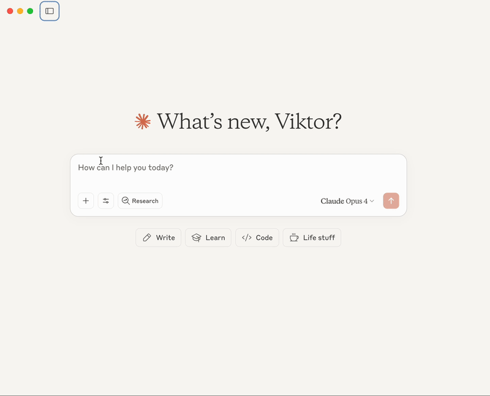
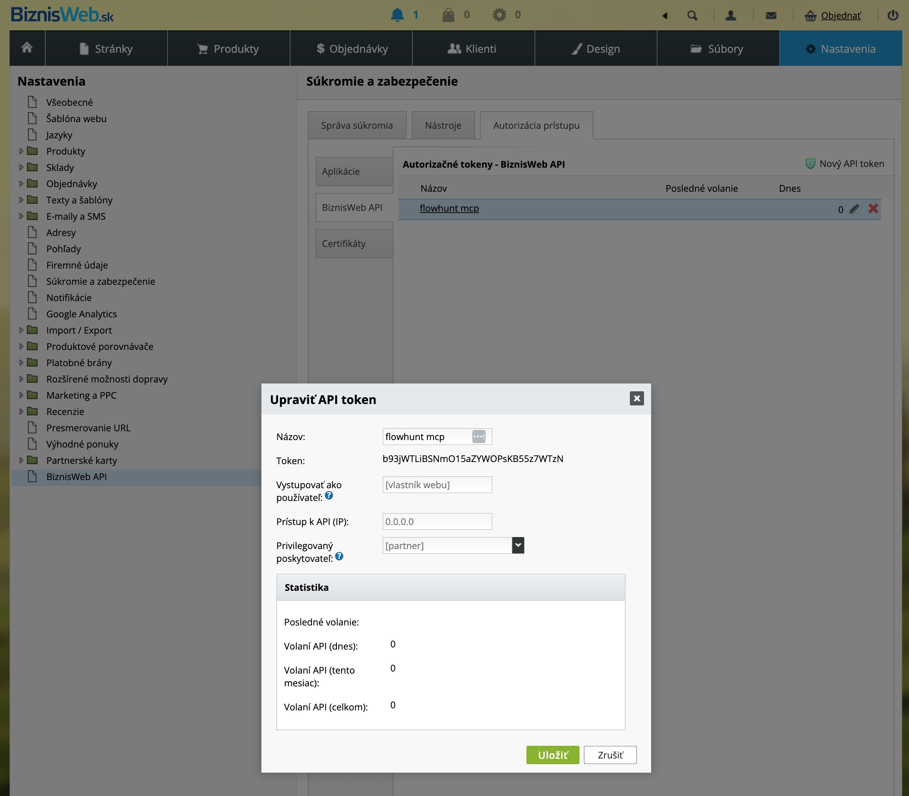

# BiznisWeb MCP Server

A Model Context Protocol (MCP) server that enables LLMs to interact with BiznisWeb e-shop through GraphQL API. This server allows AI assistants like Claude to access your BiznisWeb data directly through conversational interfaces.

## Demo



*Watch the [full video demonstration](AI-Agent-Biznisweb.mov) to see the AI agent in action with BiznisWeb data.*

## Hosted MCP Server by FlowHunt

**We can host this MCP server for BiznisWeb users at [FlowHunt](https://www.flowhunt.io)**. This means:
- No installation or setup required on your side
- Use the BiznisWeb MCP server in FlowHunt flows and automations
- **Compatible with ANY AI application that supports MCP servers** (Claude Desktop, Continue.dev, and more)
- Secure, managed infrastructure with automatic updates
- Contact us at [FlowHunt](https://www.flowhunt.io/contact) to get started

### Custom Capabilities for Your E-shop

**We can add special capabilities to this MCP server tailored to your specific needs**:
- **Custom order processing workflows** - Automate complex order handling scenarios
- **Advanced analytics and reporting** - Get insights specific to your business metrics
- **Integration with other systems** - Connect your BiznisWeb data with CRM, accounting, or warehouse systems
- **Product management automation** - Bulk updates, inventory synchronization, pricing rules
- **Customer service tools** - Automated responses, order status tracking, customer insights
- **Any custom functionality** your e-commerce business requires

If you need specific AI-powered tasks for your e-shop, we can extend this MCP server with custom tools designed for your unique business processes.

We develop MCP servers for various platforms. If you need a custom MCP server for your business, check out our services at [FlowHunt](https://www.flowhunt.io/services/mcp-server-development/).

## What is MCP?

The Model Context Protocol (MCP) is an open protocol that enables seamless integration between AI assistants and external data sources. With this MCP server, you can:

- Query your BiznisWeb orders directly from Claude Desktop or other MCP-compatible AI tools
- Get real-time statistics and insights about your e-commerce data
- Search for specific orders or customers without leaving your AI conversation
- Analyze sales trends and order patterns through natural language

### Compatible AI Applications

This MCP server works with any AI application that supports the Model Context Protocol, including:
- **Claude Desktop** - Anthropic's desktop application
- **Continue.dev** - Open-source AI code assistant
- **FlowHunt** - AI automation platform with MCP support
- **Cline** - VS Code extension with MCP support
- Any other MCP-compatible AI tool

## Features

The server provides the following tools:

### 1. `list_orders`
List orders with optional date filtering
- **Parameters:**
  - `from_date` (optional): From date in YYYY-MM-DD format
  - `to_date` (optional): To date in YYYY-MM-DD format
  - `status` (optional): Order status ID
  - `limit` (optional): Maximum number of orders to return (default: 30)

### 2. `get_order`
Get detailed information about a specific order
- **Parameters:**
  - `order_num` (required): Order number

### 3. `order_statistics`
Get order statistics for a date range (automatically excludes cancelled and pending payment orders)
- **Parameters:**
  - `from_date` (optional): From date in YYYY-MM-DD format
  - `to_date` (optional): To date in YYYY-MM-DD format

### 4. `search_orders`
Search orders by customer name, email, or order number
- **Parameters:**
  - `query` (required): Search query

## Prerequisites

- Python 3.8 or higher
- BiznisWeb API token (get it from Settings → BiznisWeb API in your BiznisWeb account)
- Claude Desktop app (for Claude integration) or any MCP-compatible client

## Installation

1. Clone the repository:
```bash
git clone https://github.com/vzeman/biznisweb-mcp-server.git
cd biznisweb-mcp-server
```

2. Create a virtual environment (recommended):
```bash
python3 -m venv venv
source venv/bin/activate  # On Windows: venv\Scripts\activate
```

3. Install dependencies:
```bash
pip install -e .
```

4. Configure API credentials:
```bash
cp .env.example .env
# Edit .env and add your BiznisWeb API token
```

The `.env` file should contain:
```
BIZNISWEB_API_TOKEN=your_api_token_here
BIZNISWEB_API_URL=https://[youraccount].flox.sk/api/graphql
```

## Usage

### Quick Start with Claude Desktop

1. **Find your Claude Desktop configuration file:**
   - macOS: `~/Library/Application Support/Claude/claude_desktop_config.json`
   - Windows: `%APPDATA%\Claude\claude_desktop_config.json`
   - Linux: `~/.config/Claude/claude_desktop_config.json`

2. **Add the BiznisWeb MCP server configuration:**

```json
{
  "mcpServers": {
    "biznisweb": {
      "command": "python",
      "args": ["-m", "biznisweb_mcp"],
      "cwd": "/Users/viktorzeman/work/biznisweb-mcp-server",
      "env": {
        "BIZNISWEB_API_TOKEN": "your_token_here",
        "BIZNISWEB_API_URL": "https://vevo.flox.sk/api/graphql"
      }
    }
  }
}
```

   **Important:** Replace `/Users/viktorzeman/work/biznisweb-mcp-server` with the actual path where you cloned this repository.

3. **Restart Claude Desktop**
   - Quit Claude Desktop completely
   - Start it again
   - You should see the hammer icon (🔨) in the text input area, indicating MCP servers are connected

4. **Verify the connection:**
   - In a new conversation, you should see "biznisweb" listed when MCP servers are active
   - Try asking: "Use the list_orders tool to show me orders from the last 7 days"

### Alternative Configuration Methods

#### Using .env file (Recommended for security)

Instead of putting your API token directly in the config, you can use the `.env` file:

```json
{
  "mcpServers": {
    "biznisweb": {
      "command": "python",
      "args": ["-m", "biznisweb_mcp"],
      "cwd": "/path/to/biznisweb-mcp-server"
    }
  }
}
```

Make sure your `.env` file in the server directory contains:
```
BIZNISWEB_API_TOKEN=your_token_here
BIZNISWEB_API_URL=https://www.vevo.sk/api/graphql
```

#### Using with UV (Fast Python package installer)

If you have `uv` installed:

```json
{
  "mcpServers": {
    "biznisweb": {
      "command": "uv",
      "args": ["run", "biznisweb-mcp"],
      "cwd": "/path/to/biznisweb-mcp-server"
    }
  }
}
```

### Testing the Server Standalone

You can test the server without Claude:

```bash
cd /path/to/biznisweb-mcp-server
source venv/bin/activate
python test_server.py
```

### With Other MCP Clients

Run the server:
```bash
python -m biznisweb_mcp
```

The server communicates via stdin/stdout using the MCP protocol.

## Example Usage in Claude

Once configured, you can interact with your BiznisWeb data naturally:

### Basic Examples

```
"Show me orders from the last 7 days"
→ Claude will use the list_orders tool automatically

"Get details for order 2502001234"
→ Claude will use the get_order tool to fetch complete order information

"What were my sales statistics for July 2025?"
→ Claude will use the order_statistics tool with appropriate date ranges

"Find all orders from customer John Doe"
→ Claude will use the search_orders tool
```

### Advanced Examples

```
"Show me today's orders and calculate the total revenue"
→ Claude will list orders and perform calculations

"Which products sold the most this week?"
→ Claude will analyze order data and summarize product sales

"Are there any pending orders that need attention?"
→ Claude will check order statuses and highlight important ones

"Compare sales between last week and this week"
→ Claude will fetch statistics for both periods and create a comparison
```

### Direct Tool Usage

You can also explicitly request specific tools:

```
Use the list_orders tool to show me orders from 2025-07-01 to 2025-07-31

Use the get_order tool to get details for order 2502001234

Use the order_statistics tool to show me sales statistics for this month

Use the search_orders tool to find orders from customer "John Doe"
```

## Environment Variables

- `BIZNISWEB_API_TOKEN`: Your BiznisWeb API token (required)
- `BIZNISWEB_API_URL`: API endpoint URL (default: https://vevo.flox.sk/api/graphql)

## Getting Your API Token

1. Log in to your BiznisWeb account
2. Navigate to: **Settings → BiznisWeb API**
3. Click the **"New API Token"** button
4. Copy the generated token
5. Add it to your `.env` file or Claude configuration

### API Token Setup in BiznisWeb

To get your API token from BiznisWeb:

1. Navigate to **Nastavenia** (Settings) in the main menu
2. Click on **BiznisWeb API** in the left sidebar
3. In the **Autorizačné tokeny** section, you'll see your existing tokens
4. Click **Nový API token** to create a new token if needed
5. Copy the token (format: `b93jWTLi8SNmO1SaZYWOPsK8S5z7WTzN`)



The screenshot above shows exactly where to find your API token in the BiznisWeb admin panel. The token is displayed in the **Token** field within the **Upraviť API token** (Edit API Token) dialog.

**Important details from the BiznisWeb API interface:**
- **Názov**: Name your token (e.g., "flowhunt mcp")
- **Token**: Your API token will be displayed here - this is what you need to copy
- **Prístup k API (IP)**: IP restrictions (0.0.0.0 means no restrictions)
- **Privilegovaný poskytovateľ**: Set to "partner" for full access
- The interface also shows API usage statistics at the bottom

## Troubleshooting

### Common Issues

1. **"BiznisWeb tools not available in Claude"**
   - Make sure you restarted Claude Desktop after adding the configuration
   - Check that the `cwd` path in the config points to the correct directory
   - Verify the hammer icon (🔨) appears in Claude's input field

2. **"API token not found" error**
   - Ensure your `.env` file exists in the server directory
   - Check that the token is correctly formatted (no extra spaces)
   - Verify the token hasn't expired in BiznisWeb

3. **"Module not found" errors**
   - Make sure you're in the virtual environment: `source venv/bin/activate`
   - Reinstall dependencies: `pip install -e .`

4. **Connection errors**
   - Check your internet connection
   - Verify the API URL is correct (should be https://vevo.flox.sk/api/graphql)
   - Ensure your BiznisWeb account has API access enabled

### Debug Mode

To see detailed logs, you can run the test script:

```bash
cd /path/to/biznisweb-mcp-server
source venv/bin/activate
python test_server.py
```

## Development

### Running in Development Mode

```bash
python biznisweb_mcp/server.py
```

### Project Structure

```
biznisweb-mcp-server/
├── biznisweb_mcp/
│   ├── __init__.py
│   └── server.py          # Main MCP server implementation
├── .env                   # Your API credentials (not in git)
├── .env.example          # Template for environment variables
├── pyproject.toml        # Project configuration
├── test_server.py        # Test script for debugging
└── README.md            # This file
```

### Adding New Tools

To add new tools to the server:

1. Add the tool definition in the `list_tools()` method
2. Implement the tool handler in the `call_tool()` method
3. Create the corresponding GraphQL query
4. Add the implementation method (e.g., `_your_new_tool()`)

## Data Filtering

The server automatically filters out orders with the following statuses:
- Storno (Cancelled)
- Platba online - platnosť vypršala (Online payment expired)
- Platba online - platba zamietnutá (Online payment rejected)
- Čaká na úhradu (Waiting for payment)
- GoPay - platebni metoda potvrzena (GoPay payment method confirmed)

This ensures that statistics and reports only include valid, completed orders.

## Security Considerations

- Never commit your `.env` file to version control
- Use environment variables or `.env` files for API tokens
- The server only has read access to your BiznisWeb data
- All communication happens locally between Claude and the MCP server

## License

This project is licensed under the MIT License.

## Support

For issues or questions:
- Contact the MCP server developers: https://www.flowhunt.io/contact
- We can develop your own MCP server, read more: https://www.flowhunt.io/services/mcp-server-development/
- Create an issue on GitHub: https://github.com/vzeman/biznisweb-mcp-server/issues
- Check the MCP documentation: https://modelcontextprotocol.io/